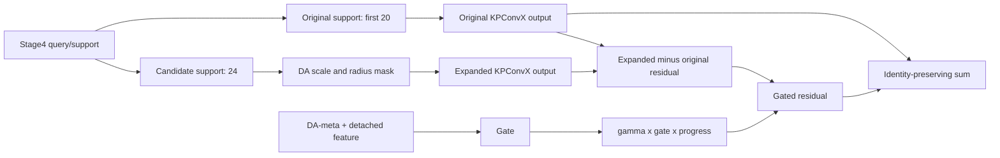

# 2026 年 6 月 20 日汇报后 KPConvX 项目进展总结

统计区间：2026-06-20 至 2026-07-16

研究任务：基于 Pointcept/KPConvX 的 S3DIS Area5 室内点云语义分割改进

硬件条件：单卡 NVIDIA RTX 4090D 24GB

## 一、阶段总览

6 月 20 日汇报之后，项目没有继续围绕单次随机验证峰值做小范围调参，而是依次完成了以下工作：

1. 补齐 v16b controlled support 的三次独立 seed 实验，确认单次 `0.7161` 不是稳定提升。
2. 设计并实现 v17 dual-support residual，用原始 KPConvX support 保底、扩展 support 只作为门控残差。
3. 完成 v17 全程训练和机制监控，定位其训练成本与 residual 实际强度。
4. 完成 v17 inference-only alpha sweep，排除“只需减弱推理期 residual 就能修复 v17”的解释。
5. 借助 GPT-5.5Pro 与 DeepSearch 对 support、边界污染、全局分支和下一步路线做证据分级。
6. 建立确定性的 S3DIS Area5 全场景固定复评工具，纠正 random crop + best-of-200 带来的排序偏差。
7. 对 Apple 官方 KPConvX 仓库、论文、Pointcept wrapper 和冻结 baseline 代码做来源核验。
8. 发现当前 Pointcept S3DIS baseline 实际沿用了 ScanNet 尺度，第一层物理感受野明显小于官方 S3DIS 配置。
9. 完成 scale04 路线二 baseline 训练和全周期固定复评，确认物理尺度校准是当前最大、最可信的提升来源。
10. 完成同协议 scale04-v17 训练，并复评 epoch 10-200、best 和 last 共 22 个 checkpoint，否定 dual-support 的跨尺度稳定收益。
11. 补齐 v16b 第三个 seed 的固定复评，得到三 seed fixed best 均值，完成 controlled support 的多 seed 裁决。
12. 直接使用 Apple 官方 KPConvX-L epoch-300 权重，在 Standalone 官方协议下复现论文 `73.5%`，并用同一 tensor 权重完成 Pointcept 协议对照。
13. 实现可复现的 `TTA13` 和 `official_vote10` 测试能力，修复旧 TTA 单独 flip 与 180 度旋转重复的问题。
14. 借助 GPT-5.6Pro 完成下一创新方向裁决，并实现独立于 v17/support 的 SOKA-Lite 固定邻域 kernel-attention conditioner；当前处于工程 smoke 前，尚无训练精度结果。

截至 2026-07-16，最重要的新结果是：

> 旧 0.02m 协议下，v17 fixed best `0.6685` 比旧 baseline `0.6556` 高 `+0.0130`；但修正 S3DIS 物理尺度后，plain scale04 baseline 在 epoch 200 达到 `0.693926`，scale04-v17 的最高值仅为 epoch 160 的 `0.693936`，差值只有 `+0.000010`，last 反而低 `0.011961`。因此旧 v17 正信号没有跨尺度保留，dual-support 不能继续作为主线。

同时，Apple 官方 KPConvX-L 权重在 Standalone 10-vote 协议下得到 `73.47% mIoU`，成功复现公开的 `73.5%`；同一组逐位一致的 tensor 在 Pointcept 4-rotation fragment 协议下只有 `68.07%`，相差 `5.40` 个百分点。由此可以确认：此前论文、训练期 random crop 和 Pointcept fixed identity 的数字差异，主要来自模型配置与推理/数据聚合协议不一致，不能混为同一条排行榜。

## 二、6 月 20 日汇报时的起点

6 月 20 日汇报已经覆盖 baseline 至 v16-local，并包含第一条 v16b 结果。汇报时主要证据如下：

| 版本 | 训练期 best mIoU | 当时结论 |
| --- | ---: | --- |
| KPConvX baseline | 0.7159 | 作为最高参考线，但当时尚未完成统一全场景复评 |
| v13 CUDA DA-Radius | 0.7096 | 接近 baseline，beam/board/window/sofa 等结构类有信号 |
| v13b conservative radius | 0.6841 | 更保守的半径策略失败 |
| v14 decoder-SGCA | 0.7004 | decoder/head 前融合比 encoder 强融合安全，但简单上下文收益不足 |
| v15 stage234 boundary gate | 约 0.5971 | boundary loss 会下降，但主分割发生负迁移 |
| v16-local DA-meta | 0.6977 | 局部统计条件器能工作，但未复现 v13 收益 |
| v16b seed 40979289 | 0.7161 | 单次略超 baseline，但只高 0.0002，可信度不足 |

当时尚未回答的问题包括：

- v16b 的 `0.7161` 是否能跨 seed 复现；
- support 扩展的正信号是真实机制收益，还是随机 crop / checkpoint 抽峰；
- v17 保留 original support 后能否解决 hard support mask 的不稳定；
- 全局/边界污染是否真的是类别下降的主因；
- 论文 `73.5%`、训练日志 `71.59%` 和项目测试结果之间为何差异很大。

## 三、6 月 20 日后的时间线

| 时间 | 工作 | 主要产出 | 阶段结论 |
| --- | --- | --- | --- |
| 06-20 | 启动 v16b 第二个 seed | `v16b-controlled-support_20260620_2030` | 用于检验 `0.7161` 的可复现性 |
| 06-29 | 启动 v16b 第三个 seed | `v16b-controlled-support-rerun_20260629_1846` | 三 seed 数据集齐；该 run 缺 PreciseEvaluator，但不影响逐 epoch val |
| 07-03 前后 | 汇总 v16b 三 seed | best 均值约 `0.7064` | 单次 `0.7161` 判为 lucky peak，不能作为论文主结论 |
| 07-06 | 实现并启动 v17 dual-support | commit `d53e6d0` | original support 保底，expanded support 只做 gated residual |
| 07-08/09 | v17 完成训练 | best `0.7084`，训练约 `44.52h` | 训练期 peak 未超过 baseline，且训练成本显著增加 |
| 07-09 | 完成 v17 alpha sweep | commit `a76a66b` | alpha 0 到 1 的差异小于 0.001，推理期强度不是修复旋钮 |
| 07-09 | 完成 DeepSearch 调研 | `S3DIS自适应Support与边界选择性路由DeepSearch报告.md` | 文献支持选择性/兼容性邻域，但项目内证据仍不足 |
| 07-10 | GPT-5.5Pro 二次裁决 | `post-v17-route-review` | 暂停下一次长时 support 训练，先锁定可信评价排序 |
| 07-10 | 实现固定协议复评和邻域审计工具 | commit `3b2ed76` | 支持全场景、类别/房间指标、双服务器合并、断点续评 |
| 07-10 | 完成服务器 A 的 6 个 best checkpoint 复评 | `kpconvx-fixed-server-a-compact` | 固定协议排序与训练期 best 排序明显不同 |
| 07-10 | 核验 Apple 官方 KPConvX 与论文配置 | 官方仓库 commit `54e644a9` | 代码是官方 wrapper，但当前 S3DIS 配置继承了 ScanNet 尺度 |
| 07-10 | 实现并启动 scale04 路线二 baseline | commit `bf4e7c6` | 先验证物理尺度失配是否是主干瓶颈 |
| 07-12/13 | 完成 scale04 baseline 训练与 checkpoint 固定复评 | epoch 200 fixed `0.693926` | 相对旧 baseline `+0.038352`，尺度校准成为新主基线 |
| 07-14/15 | 完成 scale04-v17 训练与 22 checkpoint 固定复评 | peak `0.693936@160`，last `0.681965` | 最高只比 plain baseline 高 `0.000010`，dual-support 跨尺度验证未通过 |
| 07-15 | 补齐 v16b seed 50040149 fixed best | `0.653579@167` | v16b 三 seed fixed best 均值 `0.658870`，只比旧 baseline 高 `0.003296` |
| 07-16 | 完成 Apple 官方权重双协议测试 | Standalone `73.47%`，Pointcept `68.07%` | 官方论文结果复现成功；同权重协议差异达 `5.40` 个百分点 |
| 07-16 | 扩展固定评估为 TTA13 与 official-like vote10 | commit `c98799c` | 已实现 13-view、10-vote EMA、协议元数据与独立脚本，结果待云端回收 |
| 07-16 | GPT-5.6Pro 路线裁决并实现 SOKA-Lite | commit `84a5f98` | 固定 KNN 内做 per-kernel-cell 几何 bias；代码与轻量测试完成，完整模型测试、工程 smoke 和训练待执行 |

## 四、v16b 三 seed：单次高峰未能复现

### 4.1 实验目的

v16b 使用 controlled support：先构建较大的候选邻域，再根据 DA-Radius 统计生成 effective-radius mask。它试图保留 v13 改邻域的作用，同时避免 CUDA 动态重建图的不稳定。

### 4.2 三次结果

| seed/run | best epoch | best mIoU | final mIoU | best-final drop | tail20 mean/std | 训练时长 |
| --- | ---: | ---: | ---: | ---: | ---: | ---: |
| 40979289 / 20260618 | 176 | 0.7161 | 0.6873 | 0.0288 | 0.6521 / 0.0338 | 29.32h |
| 50040149 / 20260620 | 167 | 0.7032 | 0.6642 | 0.0390 | 0.6586 / 0.0287 | 26.55h |
| 19095314 / 20260629 | 146 | 0.7000 | 0.5961 | 0.1039 | 0.6401 / 0.0308 | 29.39h |

三次 best 平均值约为：

```text
(0.7161 + 0.7032 + 0.7000) / 3 = 0.7064
```

### 4.3 客观结论

- 三个 best 都出现在后半程，但 tail20 均值只在 `0.64-0.66`，没有持续上升趋势。
- 唯一超过 baseline `0.7159` 的 run 只高 `0.0002`，远小于 seed 和随机 crop 波动。
- 增加到 300/400 日志 epoch 更可能增加“抽到高峰”的次数，而不是稳定提高均值。
- v16b 的价值是证明 controlled support 对部分样本/类别有信号，但 hard mask 路线高方差，不能作为稳定主线。

## 五、v17 dual-support residual

### 5.1 设计动机

v16b 的主要风险是 effective support 直接裁剪或替代原始邻域。v17 改为 identity-preserving 设计：

```text
conv_out = original_support_out
         + gamma * progress * gate(meta, feature)
         * (expanded_support_out - original_support_out)
```

设计约束：

- 原始 KPConvX support 始终保留；
- expanded support 只作为残差；
- 第一版只在 stage4 启用；
- base support 为 20 个邻居，candidate support 为 24 个邻居；
- `gamma` 初始化 `1e-3`，gate bias 初始化 `-2.0`；
- warmup 3400 step，ramp 5100 step；
- 保留 stage3/4 DA-meta channel bias；
- 不启用 GC mixer、boundary loss、refine 或 v15 token bank。

### 5.2 数据流



### 5.3 训练结果

| 指标 | v17 | baseline 参考 |
| --- | ---: | ---: |
| best epoch | 193 | 185 |
| random-val best mIoU | 0.7084 | 0.7159 |
| final mIoU | 0.5861 | 0.6059 |
| tail20 mean/std | 0.6514 / 0.0345 | 0.6407 / 0.0336 |
| 训练时长 | 44.52h | 24.10h |
| 平均 batch 时间 | 约 2.2523s | 约 1.2199s |

只看 random-val peak，v17 低于 baseline `0.0075`；但 v17 tail20 均值反而比 baseline 高约 `0.0107`。这已经提示单个最高点可能不能代表整体训练状态。

### 5.4 分支实际工作状态

训练后期监控约为：

| 监控项 | 后期值 | 含义 |
| --- | ---: | --- |
| `gamma` | 约 0.706 | residual 已不再接近关闭 |
| `gate_mean` | 约 0.508 | 大约一半强度通过 gate |
| `residual_ratio` | 约 0.13 | 扩展残差已形成中等影响 |
| `extra_util` | 约 0.69 | 候选扩展邻居被大量使用 |
| `fallback` | 约 0.0015 | min-keep fallback 很少触发 |

因此，v17 没有提升不能解释为“分支始终没打开”。训练变慢的主因是同一 block 内执行 original/expanded 两次邻域聚合，而不是日志或 PreciseEvaluator。

## 六、v17 inference alpha 诊断

### 6.1 目的

在不重新训练的情况下，把推理期 expanded residual 乘以：

```text
alpha = 0 / 0.25 / 0.5 / 0.75 / 1.0
```

用于判断当前 v17 是否只是 residual 太强。

### 6.2 结果

#### model_best，epoch 193

| alpha | mIoU | mAcc | allAcc |
| ---: | ---: | ---: | ---: |
| 0.00 | 0.6828 | 0.7680 | 0.8775 |
| 0.25 | 0.6833 | 0.7682 | 0.8778 |
| 0.50 | 0.6834 | 0.7683 | 0.8779 |
| 0.75 | 0.6835 | 0.7683 | 0.8780 |
| 1.00 | 0.6836 | 0.7681 | 0.8779 |

#### model_last，epoch 200

| alpha | mIoU | mAcc | allAcc |
| ---: | ---: | ---: | ---: |
| 0.00 | 0.6772 | 0.7654 | 0.8749 |
| 0.25 | 0.6777 | 0.7658 | 0.8752 |
| 0.50 | 0.6779 | 0.7660 | 0.8753 |
| 0.75 | 0.6777 | 0.7661 | 0.8754 |
| 1.00 | 0.6775 | 0.7660 | 0.8755 |

### 6.3 因果边界

直接得到的结论：

- 固定 v17 权重后，推理期缩小或关闭 expanded residual 不能明显改变 mIoU；
- `alpha<1` 没有出现有意义的提升，因此不应直接训练 gamma-cap / strength-constrained v17；
- “只需把 v17 residual 调弱就能修复”被否定。

不能得到的结论：

- alpha=0 不等于 baseline，因为 v17 主路径参数已经在 dual-support 训练中共同更新；
- 不能由此证明训练期 support 从未影响主干；
- 不能由此逻辑性否定所有尚未实现的 compatibility/selective support。

工程决策是暂停下一次 30-45 小时 support 长训，先做固定协议复评；科学结论不是“support 已被完全证伪”。

## 七、GPT-5.5Pro 与 DeepSearch 的作用

### 7.1 GPT-5.5Pro 的证据裁决

第一轮 Pro 根据 v16b/v17 日志提出：

- v17 不能算成功；
- v17 慢主要来自双路径聚合；
- expanded support 可能对 beam/board/furniture 有益，对 door/window/column/wall 等有风险；
- 先做 0-epoch alpha 诊断，再决定是否训练新版本。

alpha 结果落入“所有 alpha 基本相同”的分支后，第二轮 Pro 裁决为：

> 暂停 support 路线作为下一次长时训练；先做固定协议复评，并用邻域污染/兼容性审计判断 selective support 是否有项目内直接证据。

### 7.2 DeepSearch 的文献结论

DeepSearch 调研了 BoundaryAwareGEM、Contrastive Boundary Learning、CGA-Net、JSENet、Push-the-Boundary、PointConvFormer、PTv3 等方向，主要结论为：

- 成功的邻域扩展通常是选择性、多尺度或关系感知的，不是盲目扩大 support；
- same/different category neighbor、boundary-aware aggregation 和 feature-difference attention 与项目问题最相关；
- PTv3 的优势来自完整 serialization backbone、FlashAttention、patch scaling 和大规模训练，不适合简化成一个外挂 global token 分支；
- JSENet、Push-the-Boundary 与 KPConv 的结合最值得作为未来边界机制代码参考。

但这些结论主要提供文献动机。固定复评之前，项目内并没有足够证据立即再训练 selective support。

## 八、固定全场景复评体系

### 8.1 为什么必须改评价协议

原训练期验证使用：

```text
GridSample(mode="train")
+ SphereCrop(point_max=40000, mode="random")
```

baseline 的 200 次随机验证分布为：

| 统计项 | mIoU |
| --- | ---: |
| max | 0.7159 |
| p95 | 0.6720 |
| p90 | 0.6542 |
| tail20 mean/std | 0.6407 / 0.0336 |
| tail50 mean/std | 0.6371 / 0.0337 |

`0.7159` 明显高于大多数 epoch 和尾部均值，更像 best-of-200 高峰。它不能直接与整房间测试或论文数字比较。

### 8.2 已实现的固定协议

- 使用每个实验自己的保存配置和冻结代码；
- 严格加载相应 checkpoint；
- 使用 `data.test`，而不是随机 `data.val`；
- Area5 全部 68 个房间；
- 旧实验使用 0.02m、scale04 使用 0.04m GridSample；
- `TestSphereCrop(point_max=60000)` 将大房间分片并完整覆盖所有点；
- 输出 global、13 类、每房间 intersection/union/target；
- 每个 checkpoint 使用独立缓存目录；
- 支持断点续评、双服务器结果合并和精确 run 过滤；
- `grid_size` 已纳入协议元数据，后续 scale04 使用 `--grid-size 0.04`；
- 新增确定性 `TTA13`：4 个 Z 轴旋转乘 3 个尺度，再加一次 X 轴翻转；
- 新增 `official_vote10`：10 组可复现的官方风格几何增强，并按 `momentum=0.95` 融合概率；
- smoke 的 `room_filter/max_rooms` 已纳入 resume 元数据，避免单房间结果误判为全量完成；
- 默认无任何自动关机逻辑。

### 8.3 当前固定协议结果

两台服务器的 7 个 best checkpoint 已全部完成。v16b seed 50040149 的结果已从服务器 B 回收。

| 排名 | 模型 | seed | epoch | fixed mIoU | mAcc | OA | 相对 baseline |
| ---: | --- | ---: | ---: | ---: | ---: | ---: | ---: |
| 1 | v17 dual-support | - | 193 | **0.668531** | 0.751942 | 0.890497 | **+0.012958** |
| 2 | v16b controlled support | 40979289 | 176 | 0.667071 | 0.738710 | 0.891059 | +0.011498 |
| 3 | v13 CUDA DA-Radius | 2435054 | 175 | 0.658537 | 0.744584 | 0.887797 | +0.002964 |
| 4 | v16b controlled support | 19095314 | 146 | 0.655959 | 0.743607 | 0.886222 | +0.000386 |
| 5 | KPConvX baseline | - | 185 | 0.655574 | 0.731307 | 0.878962 | - |
| 6 | v16b controlled support | 50040149 | 167 | 0.653579 | 0.722480 | 0.888908 | -0.001995 |
| 7 | v16-local DA-meta | - | 156 | 0.652634 | 0.717985 | 0.882677 | -0.002939 |

v16b 三 seed fixed best 统计为：

```text
mean = 0.658870
std  = 0.005880
delta vs old baseline = +0.003296
```

它低于预注册的可信提升阈值 `+0.005`，因此 controlled support 即使在固定协议下也不能称为稳定提升。

### 8.4 v17 的房间级证据

相对 baseline：

- 68 个房间中，按 `mIoU_present` 计算 v17 在 46 个房间更高；
- 房间级平均差值为 `+0.02744`；
- 10,000 次配对 bootstrap 95% 区间约为 `[+0.01134, +0.04474]`；
- 按包含缺失类为 0 的 `mIoU_all` 计算，平均差值为 `+0.00817`，95% 区间约 `[+0.00234, +0.01452]`。

这说明 fixed mIoU 提升并非只来自单个房间，但当前仍只有一个 v17 seed，不能直接等同多 seed 稳定提升。

后续 scale04 对照进一步限定了这个结论：旧 v17 的 `+0.0130` 是特定 0.02m 物理尺度下的有效信号，但没有在正确的 0.04m 尺度上形成独立增益。

### 8.5 固定协议下的类别变化

| 类别 | baseline IoU | v17 IoU | 差值 |
| --- | ---: | ---: | ---: |
| ceiling | 0.87398 | 0.92477 | +0.05079 |
| clutter | 0.52124 | 0.56479 | +0.04355 |
| beam | 0.00561 | 0.04813 | +0.04252 |
| window | 0.54127 | 0.57953 | +0.03826 |
| column | 0.37400 | 0.40486 | +0.03086 |
| board | 0.75018 | 0.76367 | +0.01349 |
| wall | 0.82258 | 0.82795 | +0.00538 |
| floor | 0.98002 | 0.98213 | +0.00211 |
| chair | 0.89819 | 0.89966 | +0.00147 |
| table | 0.80663 | 0.80619 | -0.00044 |
| bookcase | 0.74963 | 0.73869 | -0.01094 |
| door | 0.50172 | 0.48634 | -0.01539 |
| sofa | 0.69742 | 0.66420 | -0.03322 |

固定协议下，window、column、clutter、ceiling 和 wall 并没有出现此前随机 best 对比中推测的系统性下降。真正仍下降的是 sofa、door、bookcase。

因此需要修正旧表述：

> “v17 的全局/扩展上下文系统性污染 wall/window/column/clutter”目前没有被固定协议支持。此前类别污染判断很大程度上混入了两个不同随机 crop checkpoint 的不可比性。边界污染仍是待审计假设，不是已证实原因。

## 九、固定复评工程问题与修复

固定复评上线过程中处理了以下工程问题：

1. 初版自动关机脚本造成实例在任务启动或失败后直接关机，日志不完整。
2. 删除训练和复评路径中所有默认 `shutdown` 调用，并增加无关机安全启动器。
3. 增加实例证据采集脚本，证明实例在无任务情况下可以稳定运行。
4. 修复 `SemSegTester` 导出 metrics 时局部 `json` 变量引发的 `UnboundLocalError`。
5. 支持只评 best checkpoint，减少当前阶段计算预算。
6. 支持 `--run-ids` 精确筛选，避免两台服务器重复评估同一 checkpoint。
7. 支持 fragment batch 调整，提高 4090D 推理利用率。
8. 日志统一保存到 `exp/fixed_protocol/logs/`，compact bundle 单独归档。
9. 完成云端存储审计：数据盘使用率达到 95%，`exp` 约 12GB；已经给出迁移到系统盘 `/root/Pointcept-exp` 并通过软链接保持原路径的安全方案。迁移是否最终完成需以云端校验输出为准。

当前复评脚本和路线二训练脚本都明确保持服务器运行，不包含成功或失败后自动关机。

## 十、Apple 官方 KPConvX 与当前 baseline 核验

### 10.1 代码来源

冻结 baseline：

```text
exp/s3dis-kpconvx-base-training_baseline/code/pointcept/models/kpconvx
```

与 Apple 官方仓库 `apple/ml-kpconvx` 的 Pointcept wrapper 基本一致：

- `kpconvx_base.py` 无实质结构差异；
- `kpnext_blocks.py` 只删除无用导入；
- `kernel_points.py` 只增加缺失的 GPU 初始化辅助函数；
- 其余主要是安装路径、缓存和编译产物。

因此当前 baseline 确实使用官方 KPConvX Pointcept backbone，参数量约 `13.51M`。

### 10.2 为什么不能直接对比论文 73.5

Apple 官方 README 明确说明：

- Pointcept `kpconvx` 是 Standalone model 的严格转换，backbone 操作相同；
- Pointcept 和 Standalone 训练 pipeline 不同，最终性能会不同；
- 论文 S3DIS 使用 Standalone，ScanNet 使用 Pointcept。

论文结果：

| 指标 | KPConvX-L S3DIS Area5 |
| --- | ---: |
| best mIoU | 73.5% |
| 10-run mean/std | 72.4 +/- 0.9% |
| mAcc | 78.7% |
| OA | 91.7% |

这些结果不能与 Pointcept random-crop `0.7159` 或 fixed identity `0.6556` 直接横向比较。

### 10.3 发现的物理尺度失配

| 配置项 | 当前 Pointcept baseline | 官方 Standalone S3DIS |
| --- | ---: | ---: |
| 初始网格 | 0.02m | 0.04m |
| `kp_radius` | 2.3 | 2.1 |
| 第一层物理半径 | 0.046m | 0.084m |
| 输入特征 | 9 维 | 5 维 |
| influence | constant | linear |
| `share_kp` | False | True |
| 训练 batch | 3，无累积 | 4 x 累积 6 |

当前第一层物理半径：

```text
0.02 x 2.3 = 0.046m
```

官方 S3DIS 配置：

```text
0.04 x 2.1 = 0.084m
```

当前 baseline 本质上是把官方 ScanNet Pointcept 配置适配到 S3DIS，而不是按 S3DIS 物理尺度重新校准。0.02m 网格保留更多点、增加显存压力，同时使同样 40000 点 crop 覆盖更小物理区域。这也可能解释 DA-Radius/support 扩展为何反复出现局部正信号：它们可能在补偿原始物理邻域偏小。

### 10.4 Apple 官方权重 Standalone 复现

2026-07-16 使用 Apple 发布的 `S3DIS_KPConvX-L` epoch-300 权重完成 Area5 全部 68 个房间的官方测试：

| 路线 | 权重 | 测试协议 | mIoU | mAcc | OA |
| --- | --- | --- | ---: | ---: | ---: |
| Apple Standalone | 官方 `current_chkp.tar` | 整房间、10 次随机 vote、完整点回投 | **73.47%** | **78.51%** | **91.74%** |
| Pointcept 对照 | 同一权重仅增加 `backbone.` 前缀 | 0.04m、4 个固定旋转、fragment 聚合 | 68.07% | 72.99% | 89.91% |

Standalone 的 `73.47%` 四舍五入后就是论文/官方公开的 `73.5%`，因此官方结果已经成功复现。权重转换核验为：

```text
source_tensors = 864
converted_tensors = 864
keys_match_after_prefix_removal = True
all_tensor_values_bitwise_equal = True
strict_load missing/unexpected keys = 0/0
shape_mismatches = 0
```

两条路线相差 `5.40` 个百分点，不是 checkpoint 转换损失，而是整房间预下采样/回投、中心化、邻域构建、测试增强次数和概率聚合方式不同。Pointcept 对照也显式构造了官方 5 维输入 `[1, R, G, B, z]`，因此不能再把差距简单归因于输入通道不匹配。

也不能据此宣称自训练 scale04 的 `69.39%` 高于官方模型的 Pointcept `68.07%`：两者 backbone 参数、输入特征、influence/share-kp、训练预算及测试增强配置都不同。`68.07%` 的用途是隔离同一官方权重在两套推理协议下的差异，不是新的模型排行榜基线。

需要注意，Apple Standalone 日志对数值标签 7/8/9/10 的显示名称与当前 Pointcept 名称顺序不同；总体混淆矩阵和 mIoU 不受影响，单类比较必须按数值标签核对。

### 10.5 当前测试协议扩展

在上述核验后，项目固定评估新增两条独立协议：

1. `TTA13`：`0/90/180/270` 度旋转乘 `1.0/0.95/1.05` 尺度，再加一次 X 轴翻转。
2. `official_vote10`：固定随机种子预采样 10 组垂直旋转、`0.99-1.01` 缩放和 X 轴 50% 翻转，并用 `(1-m) * m^(9-v)` 权重复现 `m=0.95` 的 EMA。

`official_vote10` 只能称为 official-like：它对齐测试增强和 EMA，但仍使用 Pointcept 的 voxel partition、fragment 和 index 回写，不等同 Standalone 的完整预下采样与 nearest projection。当前代码已完成并推送，scale04 自训练 baseline epoch 200 的 TTA13/vote10 结果尚未回收到本地。

## 十一、路线二：scale04 S3DIS 尺度校准

### 11.1 实验目标

第一轮不同时修改输入特征、influence、share_kp 和训练 pipeline，只隔离验证物理尺度：

```text
GridSample:       0.02 -> 0.04
subsample_size:   0.02 -> 0.04
kp_radius:        2.3  -> 2.1
kp_sigma:         2.3  -> 2.1
first_radius:     0.046m -> 0.084m
```

保持不变：

- 官方 Pointcept KPConvX 主干和约 13.51M 参数；
- 9 维 coord + color + normal 输入；
- constant influence、`share_kp=False`、`inv_groups=8`；
- batch size 3、40000 点、关闭 AMP；
- AdamW + OneCycleLR + CE + Lovasz；
- 200 个日志 epoch、每个日志 epoch 数据集 loop 5。

### 11.2 4090D 适配

- 训练仍使用 40000 点和 batch 3，峰值显存不高于旧 baseline；
- 测试使用 60000 点重叠 fragment，fragment batch 2；
- 训练结束默认 identity 单视角，不自动执行 13-view TTA；
- scale04 baseline 每 20 个日志 epoch 保存完整可恢复 checkpoint；scale04-v17 为提高曲线分辨率改为每 10 个日志 epoch 保存；
- checkpoint 包含模型、optimizer、scheduler、epoch 和历史 best；
- 路线二脚本继续调用原生 `train_autodl.sh`，会保存当次 `pointcept/`、`scripts/`、`tools/` 代码快照和合并后的 `config.py`；
- 训练脚本检查至少 4GB 可用磁盘；
- 日志保存在 `exp/route2-scale04/logs/`；
- 无自动关机。

### 11.3 scale04 baseline 实际结果

已确认云端保存配置：

```text
save_path = exp/s3dis/kpconvx-scale04-baseline_20260710_2057
seed = 57106803
backbone = kpconvx_base
grid_size = 0.04
subsample_size = 0.04
kp_radius = kp_sigma = 2.1
CheckpointSaver(save_freq=20)
```

该实验已训练完成。固定全场景结果为：

| Checkpoint | Epoch | fixed mIoU | mAcc | OA |
| --- | ---: | ---: | ---: | ---: |
| epoch 20 | 20 | 0.6110 | 0.7063 | 0.8605 |
| epoch 40 | 40 | 0.6541 | 0.7505 | 0.8820 |
| epoch 60 | 60 | 0.6292 | 0.7117 | 0.8828 |
| epoch 80 | 80 | 0.6624 | 0.7420 | 0.8926 |
| epoch 100 | 100 | 0.6496 | 0.7270 | 0.8887 |
| epoch 120 | 120 | 0.6660 | 0.7560 | 0.8845 |
| epoch 140 | 140 | 0.6699 | 0.7378 | 0.8938 |
| epoch 160 | 160 | 0.6739 | 0.7483 | 0.8948 |
| epoch 180 | 180 | 0.6866 | 0.7535 | 0.9005 |
| model_best | 193 | 0.6863 | 0.7550 | 0.9002 |
| epoch 200 / model_last | 200 | **0.693926** | **0.760752** | **0.902378** |

epoch 120 到 200 的 fixed mIoU 总体递增：

```text
0.6660 -> 0.6699 -> 0.6739 -> 0.6866 -> 0.6939
```

scale04 epoch 200 比旧 0.02m baseline best `0.655574` 高 `+0.038352`，远超过预注册的 `+0.008` 强信号线。训练期随机验证选出的 model_best epoch 193 反而比 fixed epoch 200 低 `0.007608`，进一步证明 random crop 不影响梯度优化，但会影响 checkpoint 选择。

因此 plain scale04 epoch 200 升级为当前自训练模型的可信主基线。

### 11.4 scale04-v17 跨尺度验证

在完全相同的 scale04 数据、优化器、损失和 200 日志 epoch 下，只加入 v17 stage4 dual-support。已完成 epoch 10-200、model_best 和 model_last 共 22 个 checkpoint 的固定复评。

| 比较项 | scale04 baseline | scale04-v17 | 差值 |
| --- | ---: | ---: | ---: |
| 共同 checkpoint 网格内最高 mIoU | 0.693926 @ 200 | 0.693936 @ 160 | **+0.000010** |
| 对应 mAcc | **0.760752** | 0.753759 | -0.006994 |
| 对应 OA | 0.902378 | **0.906361** | +0.003984 |
| model_best fixed mIoU | **0.686318** | 0.684036 | -0.002282 |
| model_last fixed mIoU | **0.693926** | 0.681965 | -0.011961 |

v17 没有达到预注册目标 `0.6989`。最高 mIoU 的差值 `+0.000010` 没有实际意义，且 epoch 160 后回落，last 明显更差。因此 dual-support 的旧 0.02m 正信号没有跨尺度保留，现有 support 路线正式停止作为下一轮长训主线。

scale04-v17 约 23.7 小时完成，明显快于旧 v17 的 44.5 小时。已确认它确实使用 `KPConvXV17` 和双路径；提速主要来自 0.04m GridSample 显著减少活跃点，而不是误跑 baseline。当前本地仍缺 scale04-v17 原始训练日志，因此 batch time、点数分布和后期 gate/gamma 精确统计尚未补齐。

### 11.5 预注册规则执行结果

1. scale04 baseline 相对旧 baseline 提高 `+0.0384`：通过，物理尺度失配是重要瓶颈。
2. scale04 多 checkpoint 后期持续改善：通过，升级为新主基线。
3. scale04-v17 相对 plain baseline 至少提高 `+0.005`：未通过。
4. scale04-v17 不造成主要类别明显下降：未通过，window/column/board/sofa 存在风险。
5. 结论：保留 scale04，淘汰 dual-support 主线，不再用更多 epoch/seed 为 v17 抽峰。

## 十二、已完成的代码与文档产出

### 12.1 v17

- `pointcept/models/kpconvx_hybrid/kpx_v17.py`
- `pointcept/models/kpconvx_hybrid/da_kpnext_blocks.py`
- `configs/s3dis/semseg-kpconvx-hybrid-v17-dual-support-area5.py`
- Git commit：`d53e6d0`

### 12.2 alpha 诊断

- `tools/eval_v17_alpha_sweep.py`
- `docs/exp_result/v17_alpha消融实现记录.md`
- Git commit：`a76a66b`

### 12.3 固定复评与邻域审计

- `tools/eval_s3dis_fixed_protocol.py`
- `tools/s3dis_fixed_protocol.py`
- `tools/audit_v17_neighbor_compatibility.py`
- `configs/s3dis/eval/kpconvx_fixed_protocol_v1.json`
- `tests/test_s3dis_fixed_protocol.py`
- `docs/exp_result/kpconvx_fixed_protocol_runbook.md`
- Git commit：`3b2ed76` 及后续修复提交

### 12.4 scale04 路线二

- `configs/s3dis/semseg-kpconvx-base-s3dis-scale04-4090d-area5.py`
- `configs/s3dis/semseg-kpconvx-hybrid-v17-scale04-4090d-area5.py`
- `scripts/train_route2_scale04.sh`
- `tests/test_s3dis_scale04_configs.py`
- `docs/exp_result/kpconvx_official_baseline_scale_calibration_summary.md`
- Git commit：`bf4e7c6`

### 12.5 研究材料

- `GPT-5.5Pro/v16b-parallel-review/`
- `GPT-5.5Pro/v17-next-decision/`
- `GPT-5.5Pro/post-v17-route-review/`
- `docs/deepsearch/S3DIS自适应Support与边界选择性路由DeepSearch报告.md`

### 12.6 官方权重与测试协议

- Apple 官方权重双协议原始报告：`D:/虚拟C盘/Edge下载/EVAL_RESULTS_20260716.md`
- `docs/exp_result/KPConvX官方测试协议对齐说明.md`
- `pointcept/datasets/transform.py`：新增单轴翻转，避免旧 TTA flip 与 180 度旋转重复
- `pointcept/engines/test.py`：支持 fragment/view 级概率权重
- `tools/s3dis_fixed_protocol.py`：新增 seeded TTA/vote 构造和 EMA 权重
- `tools/eval_s3dis_fixed_protocol.py`：新增 `official_vote10` stage、协议元数据和部分房间 resume 隔离
- `scripts/run_scale04_test_protocols.sh`：scale04 epoch 200 的 smoke/full 测试入口
- Git commit：`c98799c`

官方权重的转换配置、checkpoint 和 68 房间预测当前仍在云端报告所列路径，本地 `exp/` 尚未同步这些大文件；本地已保存总体指标、hash 和逐位一致性证据。

### 12.7 SOKA-Lite 新主线候选

- `pointcept/models/kpconvx_soka/soka_geometry.py`
- `pointcept/models/kpconvx_soka/soka_blocks.py`
- `pointcept/models/kpconvx_soka/kpconvx_soka.py`
- `configs/s3dis/semseg-kpconvx-soka-lite-scale04-4090d-area5.py`
- `configs/s3dis/semseg-kpconvx-soka-lite-stage4-scale04-4090d-area5.py`
- `tests/test_kpconvx_soka_geometry.py`
- `tests/test_kpconvx_soka_model.py`
- `tests/test_s3dis_soka_configs.py`
- `GPT-5.6Pro/kpconvx-next-innovation/02_SOKA_Lite_implementation_digest.md`
- Git commit：`84a5f98`

SOKA-Lite 不改变 KNN support、radius、neighbor limit、pooling、decoder 或损失。它复用 KPConvX 的 nearest-kernel assignment，为每个 query/kernel cell 构造 occupancy、radial、assignment mean/variance、entropy 和 shell radius 六维描述，经 zero-last `6 -> 16 -> 1` MLP 在 attention activation 前加入 scalar bias。默认作用于 encoder stage2-5，stage4 配置只用于 500-1000 iteration 工程 smoke。本机 geometry/config 轻量测试为 `9 passed`；完整模型测试依赖云端 Pointcept/CUDA 扩展环境。当前只能写“实现和轻量测试完成”，不能写成“完整工程验收”或“精度提升”。

## 十三、当前可以确认与仍不能确认的结论

### 13.1 已有较强证据支持

1. v16b 单次 `0.7161` 不是稳定多 seed 提升。
2. v17 expanded residual 在训练后期确实被使用，不是零初始化后一直无效。
3. v17 训练慢的主要原因是 dual-support 双路径聚合。
4. inference-only alpha tuning 不能修复 v17。
5. random crop best-of-200 会显著影响模型排序和类别解释。
6. 固定全场景 identity 下，旧 v17 best 高于旧 baseline `+0.0130 mIoU`，但该信号只成立于 0.02m 尺度。
7. v16b 三 seed fixed best 均值为 `0.658870`，只比旧 baseline 高 `0.003296`，未达到可信阈值。
8. scale04 plain KPConvX epoch 200 达到 `0.693926`，比旧 baseline 提高 `+0.038352`，物理尺度失配已被证实是重要瓶颈。
9. scale04-v17 最高只比 scale04 baseline 高 `+0.000010`，last 低 `0.011961`；dual-support 没有独立跨尺度收益。
10. 当前 baseline 使用官方 KPConvX Pointcept backbone，但不是论文 S3DIS Standalone 模型和训练协议。
11. Apple 官方 KPConvX-L 权重已在 Standalone 10-vote 下复现 `73.47%`；论文 `73.5%` 本身没有复现问题。
12. 同一官方 tensor 权重在 Pointcept 4-rotation fragment 协议下为 `68.07%`，证明测试/数据聚合协议足以造成 `5.40` 个百分点差异。
13. checkpoint 选择应依据固定全场景曲线；scale04 的 random-val best epoch 193 不是 fixed 最优，epoch 200 更高。
14. SOKA-Lite 当前满足“固定 support、单次聚合、零初始化 attention bias”的独立机制边界，没有重复 v16/v17 的 support 扩展。

### 13.2 仍未确认

1. scale04 baseline 的 `0.693926` 能否跨 seed 复现；当前只有一个完整训练 seed。
2. 自训练 scale04 epoch 200 在 TTA13 和 official-like vote10 下能提高多少；代码已实现，结果未回收。
3. Pointcept 对官方权重的 `68.07%` 中，各项差距分别有多少来自中心化、initial subsampling/projection、邻域构建和 vote 聚合；当前只有整体对照。
4. boundary pollution 是否真实存在；固定类别结果已经削弱此前推测，不能作为下一结构的既定前提。
5. expanded-only neighbor 的跨类污染率能否被 entropy、margin 或 DA-meta 预测；审计工具已实现但正式审计尚未完成。
6. SOKA-Lite 的显存、速度和梯度行为是否满足工程止损线；云端 500-1000 iteration smoke 尚未执行。
7. SOKA-Lite 是否能相对 scale04 baseline 提高至少 `+0.005`；当前没有训练结果。
8. PTv3 是否适合作为独立 backbone benchmark；尚未进行同预算训练。
9. scale04-v17 原始 `train.log` 尚未同步，本阶段只能从 checkpoint 时间和 fixed 曲线分析训练速度。

## 十四、下一阶段计划

### 优先级 1：完成汇报证据归档

- 将本文件作为 6 月 20 日后主汇报文档；
- 保留 official Standalone、Pointcept 对照、scale04 baseline 和 scale04-v17 四条协议名称，禁止只写一个无协议的“准确率”；
- 从云端同步官方权重转换配置、测试脚本、最终混淆矩阵与 Pointcept 指标文件，补齐本地可复现证据；
- scale04-v17 原始日志可在汇报后补，不阻塞当前结构结论。

### 优先级 2：完成自训练主基线的测试增强对照

- 先对 scale04 epoch 200 跑单房间 TTA13/official_vote10 smoke；
- smoke 无 OOM 后再跑 Area5 全量；
- identity `0.693926`、TTA13、official-like vote10 分开报告；
- 即使 official-like 提升，也不能称为 Standalone 官方成绩。

### 优先级 3：SOKA-Lite 工程 smoke

- 先运行完整 geometry/model/config 测试；
- 只开 stage4 做 500-1000 iteration smoke；
- 检查 zero-init 等价、梯度、NaN、显存增幅 `<=10%`、iteration time 增幅 `<=15%`；
- batch size 降为 2 或速度超过 baseline `1.2x` 时停止，不启动长训。

### 优先级 4：SOKA-Lite 受控实验

- 工程 smoke 通过后，先做同 checkpoint、同预算的 baseline/SOKA matched continuation；
- fixed dev mIoU 至少 `+0.003` 且多数房间同向，才进入 stage2-5 正式首 seed；
- 正式成功线为 Area5 fixed mIoU `>=0.6989`，强结果线为 `>=0.7019`；
- 失败后再讨论 PTv3 独立 benchmark，不把 PTv3 简化为外挂分支。

### 暂缓

- 不继续扩大 support range 或增加 stage；
- 不训练简单 gamma-cap / strength-constrained v17；
- 不把 boundary loss 或 global mean token 换名重做；
- 不立即把 PTv3 serialization 简化成外挂 global branch；
- 邻域污染审计未提供 Go 证据前，不训练 selective support；
- 不把 SOKA 与 v17、DA-Radius、boundary、global 或新 loss 同时堆叠。

## 十五、面向导师的简要汇报表述

可以将本阶段概括为：

> 6 月 20 日之后，我先补齐了 controlled support 的三 seed 实验，证明单次 0.7161 不具备稳定性；随后实现 v17 dual-support，并通过监控确认扩展分支确实参与训练，但推理期 alpha 消融和 0.04m 跨尺度实验都没有支持继续扩大 support。评价方面，我建立了 Area5 全场景固定复评体系，发现训练期 random crop 会改变 checkpoint 排序。进一步对齐 S3DIS 物理尺度后，plain KPConvX 从旧 fixed 0.6556 提高到 0.6939，而同协议 scale04-v17 的最高值只多 0.00001，说明旧 v17 收益主要依赖尺度和 checkpoint 条件，不是独立稳定增益。官方核验方面，我用 Apple 官方 KPConvX-L 权重在 Standalone 10-vote 下复现了 73.47%，但同一 tensor 权重在 Pointcept 4-rotation fragment 协议下只有 68.07%，直接证明论文结果和当前 Pointcept 指标不能混比。基于这些证据，当前主基线固定为 scale04 plain KPConvX，support 路线暂停；下一步已经实现不改邻域、只在 kernel attention 内加入 occupancy/assignment 几何 bias 的 SOKA-Lite，先做低成本工程 smoke，再决定是否长训。

## 十六、当前阶段一句话结论

6 月 20 日之后，项目完成了从随机峰值驱动到固定协议驱动的转变：scale04 将可信基线提高到 `0.6939`，scale04-v17 证明 support 扩展没有独立收益，官方权重双协议测试解释了 `73.5%` 与 Pointcept 结果的主要口径差异，下一步只保留固定邻域内的 SOKA-Lite 作为受控创新候选。

## 十七、汇报数字总表

| 对象 | 协议 | mIoU | 当前解释 |
| --- | --- | ---: | --- |
| 旧 Pointcept baseline best | 训练期 random crop | 0.7159 | best-of-200 高峰，不作为最终主结果 |
| 旧 Pointcept baseline | 0.02m fixed identity | 0.655574 | 旧固定基线 |
| 旧 v17 | 0.02m fixed identity best | 0.668531 | 相对旧 baseline `+0.012958`，但未跨尺度保留 |
| v16b 三 seed | 0.02m fixed identity best 均值 | 0.658870 | `+0.003296`，低于可信阈值 |
| **scale04 plain KPConvX** | **0.04m fixed identity epoch 200** | **0.693926** | **当前自训练可信主基线** |
| scale04-v17 | 0.04m fixed identity peak epoch 160 | 0.693936 | 只高 `0.000010`，实质持平 |
| scale04-v17 | 0.04m fixed identity last | 0.681965 | 比 plain baseline 低 `0.011961` |
| Apple 官方 KPConvX-L | Standalone 官方 10-vote | **73.47%** | 成功复现官方 `73.5%` |
| 同一 Apple 官方权重 | Pointcept 4-rotation fragment | 68.07% | 协议差异造成 `-5.40` 个百分点 |
| SOKA-Lite | 尚未训练 | - | 代码/轻量测试完成，等待完整模型测试与工程 smoke |

## 十八、证据文件与本地完整性

本次更新直接核对了以下本地结果：

- `exp/kpconvx-fixed-server-a-compact/screen/`：旧 baseline、v13、v16-local、两条 v16b 和 v17 的 fixed best；
- `exp/fixed_protocol/results/kpconvx-fixed-server-b/screen/`：v16b seed 50040149 fixed best，`complete=true`；
- `exp/scale04-baseline-all-checkpoints/screen/`：本地现有 epoch 20/40/60/80/100、best、last 共 7 组原始 metrics；
- `exp/v17-scale04-concurrent-screening/screen/`：scale04-v17 共 22 组结果，`complete=true`；
- `exp/kpconvx-scale04-baseline_20260710_2057/`：scale04 baseline 保存配置、权重与训练日志；
- `D:/虚拟C盘/Edge下载/EVAL_RESULTS_20260716.md`：Apple 官方权重双协议测试报告。

需要补归档的原始证据：

1. scale04 baseline epoch 120/140/160/180 的数值已写入既有汇总文档，但当前本地 `scale04-baseline-all-checkpoints` 中对应原始 metrics 未同步，目录仍保留历史 `failed_entries.json`；汇报数字可用，后续应补齐原文件。
2. Apple Standalone 的 `full_conf_009.txt`、Pointcept 68 个房间预测、官方权重转换配置和 checkpoint 仍在云端报告路径，本地尚未保存。
3. scale04-v17 原始 `train.log` 未在当前下载包中，无法精确复算 batch time 和后期机制监控。
4. 自训练 scale04 epoch 200 的 TTA13/official-like vote10 尚无本地结果目录，不能提前写入汇报成绩。

其他汇总来源包括：

- `docs/exp_result/KPConvX全部实验结果汇总.md`
- `docs/exp_result/kpconvx_experiment_route_summary.md`
- `docs/exp_result/s3dis_fixed_protocol_results_20260714.md`
- `docs/exp_result/kpconvx_official_baseline_scale_calibration_summary.md`
- `docs/exp_result/KPConvX官方测试协议对齐说明.md`
- `GPT-5.6Pro/kpconvx-next-innovation/02_SOKA_Lite_implementation_digest.md`
